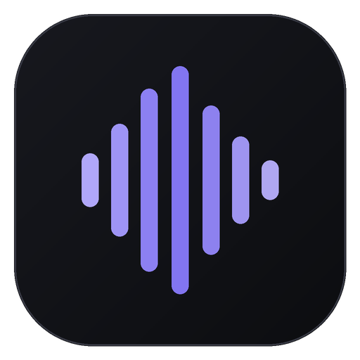

<p align="center">
  
</p>

<h1 align="center">Flowtype</h1>

<p align="center">
  <strong>Hold a key. Speak. Release. Clean text appears where you were typing.</strong>
</p>

<p align="center">
  Native Windows push-to-talk — system-wide, offline-first, no account.<br>
  One executable. ~60 MB full stack. Keys sealed with DPAPI.
</p>

<p align="center">
  <a href="https://github.com/vectorfx/flowtype/releases/latest"><strong>Download</strong></a>
  ·
  <a href="#install">One-line install</a>
  ·
  <a href="#quick-start">Quick start</a>
  ·
  <a href="#privacy">Privacy</a>
</p>

---

## Overview

Most dictation tools want a subscription, a cloud login, or a half-gig model before you say a word. Flowtype is built around speed and restraint: a tray-resident app that captures speech globally, cleans it locally, and pastes into whatever had focus — Slack, browser, IDE, terminal, all of it.

Warm whisper.cpp between takes. Turbo path for long dictations. Built-in cleanup in milliseconds — fillers, punctuation, spoken numbers, lists — without routing every sentence through an LLM. Context-aware writing rules when tone should match the app you're in. Click-through voice capsule with matte themes or liquid glass. Smart paste with clipboard fallback. Latency strip on every take. Mic health diagnostics. Tray shortcut to fix the last misheard word. Recovery when something goes sideways.

Optional [Groq](https://console.groq.com) or OpenAI for cloud ASR. Optional LLM polish. Both off unless you turn them on.

---

## Specs

| | |
|---|---|
| **Platform** | Windows 10 / 11 (x64) |
| **Install** | User folder · no admin · ~15 MB Lite / ~60 MB offline |
| **Capture** | Global push-to-talk · any focused field |
| **Overlay** | Animated click-through capsule · no focus steal |
| **Speech** | Local whisper.cpp · Groq / OpenAI optional |
| **Output** | Smart paste · offline cleanup · LLM polish optional |
| **Privacy** | No account · no telemetry · DPAPI keys |

---

## Install

Open PowerShell and run:

```powershell
irm https://raw.githubusercontent.com/vectorfx/flowtype/main/install.ps1 | iex
```

Downloads the latest Lite release, installs to `%LOCALAPPDATA%\Flowtype`, adds shortcuts, and starts the app.

---

## Quick start

**One-line:** see [Install](#install) above.

**Manual:**

1. **Download** the latest **Lite** or **Full** ZIP from [Releases](https://github.com/vectorfx/flowtype/releases).
   - **Lite** (~15 MB) — downloads the speech model on first local use
   - **Full** (~58 MB) — Instant model bundled, offline immediately
2. **Extract** to a normal folder (e.g. `Flowtype\`, not directly in `Downloads`).
3. Run **`Install Flowtype.bat`**.
4. Hold **`Win + Ctrl`**, speak, release.

> **First run:** Local mode needs no API key. For Groq, paste a free key under Settings → Cloud engines.

---

## Everyday controls

| Action | Result |
|---|---|
| Hold **Win + Ctrl** | Record — voice capsule appears |
| Release either key | Transcribe → clean → paste (or copy if focus changed) |
| **Escape** while recording | Cancel |
| Left-click tray icon | Open Settings |
| Right-click tray | Settings, history, recovery, quit |
| Right-click tray → **Fix "word" in dictionary…** | Add a spelling fix after a bad transcription |

---

## Voice capsule

**Settings → General → Voice capsule**

| Theme | |
|---|---|
| **Dark** *(default)* | Matte near-black, zinc borders |
| **Dark purple** | Matte purple |
| **Light** | Clean white |
| **Mono** | High-contrast black & white |
| **Liquid glass** | Live-desktop glass |

Optional embedded audio cues on start and finish.

---

## Speech engines

| Engine | | |
|---|---|---|
| **Local** *(default)* | Offline · warm server between takes |
| **Groq** | Free tier · `whisper-large-v3-turbo` |
| **OpenAI** | Bring your own key |

### Groq setup

1. [console.groq.com](https://console.groq.com) → **API Keys** → **Create API Key**
2. Settings → **Groq** → paste key under **Cloud engines**
3. Keep cleanup on **Built-in rules**

Audio goes to Groq for transcription only unless you opt into cloud cleanup.

---

## When is AI used?

| Path | |
|---|---|
| Local + built-in cleanup **(default)** | ASR only |
| Groq / OpenAI speech | Cloud transcription |
| OpenRouter / OpenAI / Ollama cleanup | Optional polish — off by default |

---

## Settings

**Performance** — turbo path · mic boost · mic health test · latency strip

**Writing** — smart cleanup · context-aware rules · dictionary & snippets

---

## Privacy

- No Flowtype account or analytics server
- API keys stored with Windows DPAPI (per user, per machine)
- Successful recordings deleted immediately
- History off by default
- Failed audio kept locally only if **Recovery** is enabled (`%APPDATA%\Flowtype\Recovery`)

---

## Build from source

Requires Windows with .NET Framework 4.x (built into Windows). No Visual Studio needed.

```powershell
git clone https://github.com/vectorfx/flowtype.git
cd flowtype
./tools/Fetch-Fonts.ps1
./tools/Build-Flowtype.ps1
./tests/Run-Tests.ps1
```

Output: `Flowtype.exe` in the repo root. Audio cues and fonts are embedded at build time.

---

## Project layout

```
flowtype/
├── src/Flowtype.cs          # Single-file app
├── install.ps1              # One-line installer script
├── assets/                  # Icon, fonts, audio cues
├── tools/                   # Build, package, font fetch
├── installer/               # Install-Flowtype.ps1
└── tests/Run-Tests.ps1
```

See [docs/ARCHITECTURE.md](docs/ARCHITECTURE.md) for internals.

---

## Uninstall

Quit from the tray, then run **`Uninstall Flowtype.bat`**.

Settings and keys in `%APPDATA%\Flowtype` are kept unless you delete that folder manually.

---

## Third-party

See [THIRD-PARTY-NOTICES.md](THIRD-PARTY-NOTICES.md).

- whisper.cpp (MIT)
- ggml Whisper models (MIT)
- Roboto Mono (Apache 2.0)

---

## License

MIT — see [LICENSE](LICENSE).
