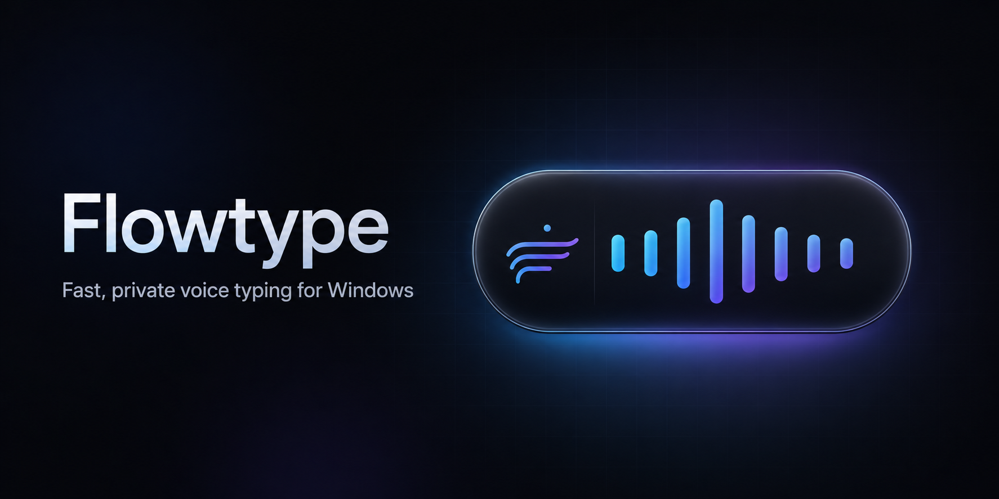

<p align="center">
  
</p>

# Flowtype

**Hold a key, speak, release — cleaned text appears where you were typing.**

Flowtype is a lightweight Windows tray app for system-wide push-to-talk dictation. It runs locally by default (no account, no subscription), keeps your API keys encrypted with Windows DPAPI, and stays out of your way until you need it.

<p align="center">
  
</p>

## Why Flowtype?

- **Private by default** — local whisper.cpp transcription, offline cleanup, no telemetry
- **Actually fast** — warm model, turbo mode for long dictations, optional Groq cloud
- **Feels good** — live voice capsule, start/complete audio cues, instant key-release hide
- **No admin install** — one-click installer for `%LOCALAPPDATA%`

## Quick start

1. Download the latest **Full** release ZIP from [Releases](https://github.com/vectorfx/flowtype/releases) (~58 MB, includes speech model).
2. Extract to a folder and run **Install Flowtype.bat**.
3. Hold **Win + Ctrl**, speak, release. Text inserts into the focused field.

First launch needs no API key. The Instant English model is bundled in the Full installer.

## Everyday controls

| Action | Result |
|---|---|
| Hold **Win + Ctrl** (default) | Record — small voice capsule appears |
| Release either key | Transcribe, clean, paste (or copy if focus changed) |
| **Escape** while recording | Cancel |
| Tray icon / shortcut | Open Settings |
| Right-click tray | Settings, history, recovery, quit |

## Speech engines

| Engine | Best for | Notes |
|---|---|---|
| **Local** (default) | Privacy, offline | Instant model (~60 MB). Warm server stays loaded between dictations. |
| **Groq** | Speed + accuracy online | Free API tier at [console.groq.com](https://console.groq.com). Model: `whisper-large-v3-turbo`. |
| **OpenAI** | Your own OpenAI key | Optional; you pay OpenAI directly. |

For higher accuracy than local Instant, use **Groq** — same large-v3-turbo class model in the cloud, no 574 MB download, typically faster than any local CPU run.

### Free Groq setup (recommended cloud option)

1. Go to [console.groq.com](https://console.groq.com) and create an account.
2. Open **API Keys** → **Create API Key**.
3. In Flowtype Settings → **General** → Speech engine: **Groq**.
4. Paste your key on the **Cloud engines** tab. Leave model as `whisper-large-v3-turbo`.
5. Keep cleanup on **Built-in rules** for speed.

Audio is sent to Groq for transcription only. Cleanup stays local unless you choose a cloud cleanup engine.

## When is AI used?

| Path | AI? |
|---|---|
| Local speech + built-in cleanup (default) | ASR model only — no ChatGPT-style rewrite |
| Groq / OpenAI speech | Cloud transcription |
| OpenRouter / OpenAI / Ollama cleanup | Optional LLM polish (off by default) |

## Performance settings

In **Settings → General → Performance**:

- **Turbo transcription** — skips expensive word timestamps on long dictations (recommended)
- **Microphone boost** — software gain + normalization for quiet mics
- **Microphone health** — live level meter and **Test 3s** to catch quiet-mic issues before blaming whisper
- **Latency strip** — last dictation breakdown (record · transcribe · clean · total ms)

Right-click the tray icon → **Fix "word" in dictionary…** after a dictation to add a spelling correction without opening Settings.
- **Latency strip** — shows record / transcribe / clean / total ms for the last dictation

## Privacy

- No Flowtype account or analytics server
- API keys stored with Windows DPAPI (per user)
- Successful recordings deleted immediately
- History off by default
- Failed audio kept locally only if recovery is enabled

## Build from source

```powershell
git clone https://github.com/vectorfx/flowtype.git
cd flowtype
./tools/Generate-RecordingCue.ps1
./tools/Build-Flowtype.ps1
./tests/Run-Tests.ps1
```

Requires Windows with .NET Framework (built into Windows). No Visual Studio needed.

## Uninstall

Quit from the tray, then run **Uninstall Flowtype.bat**. Settings in `%APPDATA%\Flowtype` are kept unless you remove them manually.

## Third-party

See [THIRD-PARTY-NOTICES.md](THIRD-PARTY-NOTICES.md). whisper.cpp (MIT), ggml models (MIT), Inter font (OFL).

## License

MIT — see [LICENSE](LICENSE).
