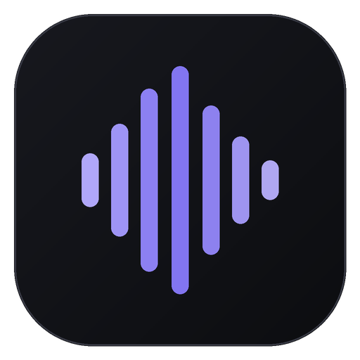

<p align="center">
  
</p>

<h1 align="center">Flowtype</h1>

<p align="center">
  <strong>System-wide push-to-talk dictation for Windows.</strong>
</p>

<p align="center">
  Offline by default · tray-resident · single executable<br>
  Local whisper.cpp · optional Groq/OpenAI · API keys stored with DPAPI
</p>

<p align="center">
  <a href="https://github.com/vectorfx/flowtype/releases/latest"><strong>Download</strong></a>
  ·
  <a href="#install">One-line install</a>
  ·
  <a href="#quick-start">Quick start</a>
  ·
  <a href="#privacy">Privacy</a>
</p>

---

## Overview

Flowtype is a tray-resident Windows app for push-to-talk dictation. Hold a hotkey, speak, release — the recording is transcribed, cleaned, and inserted into whatever field had focus when you started.

**Default stack:** local whisper.cpp (Instant model, ~60 MB), built-in rule cleanup, paste into the active control. No account, no telemetry, no cloud unless you enable it.

**Optional:** Groq or OpenAI for transcription; OpenRouter, OpenAI, or a local streaming model (Ollama / LM Studio / llama.cpp) for LLM cleanup. All cloud paths are off by default.

The experimental **agent chord** (voice → a local CLI you already trust) ships in the app, off by default. The loopback daemon is in the zip (`agent-bridge/`). Each person runs it on **their** PC — it does not bind the LAN.

Implementation notes:

- Single-file C# app (`src/Flowtype.cs`) with a global hotkey hook and WAV capture at 16 kHz
- whisper.cpp server kept warm between takes; Groq/OpenAI used when configured
- Cleanup handles fillers, punctuation, spoken lists, dictionary replacements, and app-context hints from the foreground window title
- Click-through recording overlay; clipboard restored after insert unless you opt to keep dictation on the clipboard
- Mic level test reports raw, boosted, and estimated Whisper input levels

See [docs/ARCHITECTURE.md](docs/ARCHITECTURE.md) for the full pipeline.

---

## Specs

| | |
|---|---|
| **Platform** | Windows 10 / 11 (x64) |
| **Install** | User folder · no admin · Full zip includes the offline speech model |
| **Capture** | Global push-to-talk · any focused field |
| **Overlay** | Animated click-through capsule · no focus steal |
| **Speech** | Local whisper.cpp · Groq / OpenAI optional |
| **Output** | Paste into focused field · rule cleanup · optional LLM |
| **Privacy** | No account · no telemetry · DPAPI keys |

---

## Install

Open PowerShell and run:

```powershell
irm https://raw.githubusercontent.com/vectorfx/flowtype/main/install.ps1 | iex
```

Downloads the latest Full release (app + offline Instant model + agent bridge), installs to `%LOCALAPPDATA%\Flowtype`, adds shortcuts, and starts the app.

---

## Quick start

**One-line:** see [Install](#install) above.

**Manual:**

1. **Download** the latest ZIP from [Releases](https://github.com/vectorfx/flowtype/releases).
   - **Full** (~60 MB) — Instant speech model bundled, offline immediately. This is the one you want.
   - **Lite** (~15 MB) — same app, model downloaded later if you use local Whisper. Kept so older installs can auto-update.
2. **Extract** to a normal folder (e.g. `Flowtype\`, not directly in `Downloads`).
3. Run **`Install Flowtype.bat`**.
4. Hold **`Win + Ctrl`**, speak, release.

Optional agent chord: Settings → Agent → **Connect OpenCode** or **Connect Claude**. You do not launch those apps first. Hold the agent key (default **Win + Alt**), speak, release.

> **First run:** Local mode needs no API key. For Groq, paste a free key under Settings → Cloud engines.

---

## Everyday controls

| Action | Result |
|---|---|
| Hold **Win + Ctrl** | Record — voice capsule appears |
| Release either key | Transcribe → clean → paste (or copy if focus changed) |
| **Escape** while recording | Cancel |
| Left-click tray icon | Open Settings |
| Right-click tray | Settings, history, recovery, quit |
| Right-click tray → **Fix "word" in dictionary…** | Add a spelling fix after a bad transcription |

---

## Voice capsule

**Settings → General → Voice capsule**

| Theme | |
|---|---|
| **Dark** *(default)* | Matte near-black, zinc borders |
| **Dark purple** | Matte purple |
| **Light** | Clean white |
| **Ember** | OLED black, copper-to-cream waveform |
| **Liquid glass** | Frosted pane — the desktop behind it tints the glass |

**Settings → General → Live mark**

| Mark | |
|---|---|
| **Orb** *(default)* | Soft glowing sphere that blooms when you talk |
| **Hex** | Seven-dot cluster |
| **Iris** | Aperture that opens with your voice |
| **Grid** | Circular equalizer dots |

Optional embedded audio cues on start and finish.

---

## Spoken lists

**Settings → Personalization → Spoken lists**

| Say | Result |
|---|---|
| **next point** *(default)* | New bullet |
| **next number** *(default)* | New numbered item |

Turn it off, or type a different phrase, in Settings. Extra phrases can be comma-separated.

---

## Speech engines

| Engine | | |
|---|---|---|
| **Local** *(default)* | Offline · warm server between takes |
| **Groq** | Free tier · `whisper-large-v3-turbo` |
| **OpenAI** | Bring your own key |

### Groq setup

1. [console.groq.com](https://console.groq.com) → **API Keys** → **Create API Key**
2. Settings → **Groq** → paste key under **Cloud engines**
3. Keep cleanup on **Built-in rules**

Audio goes to Groq for transcription only unless you opt into cloud cleanup.

---

## When is AI used?

| Path | |
|---|---|
| Local + built-in cleanup **(default)** | ASR only |
| Groq / OpenAI speech | Cloud transcription |
| OpenRouter / OpenAI / local streaming model | Optional polish — off by default |

---

## Settings

**General** — hotkey · hands-free mode · speech engine · cleanup · mic boost · mic test

**Personalization** — spoken lists · dictionary · snippets

**Cloud** — Groq · OpenAI · OpenRouter cleanup

**Local** — whisper.cpp install · local streaming model (Ollama / LM Studio / llama.cpp)

---

## Privacy

- No Flowtype account or analytics server
- API keys stored with Windows DPAPI (per user, per machine)
- Successful recordings deleted immediately
- History off by default
- Failed audio kept locally only if **Recovery** is enabled (`%APPDATA%\Flowtype\Recovery`)

---

## Build from source

Requires Windows with .NET Framework 4.x (built into Windows). No Visual Studio needed.

```powershell
git clone https://github.com/vectorfx/flowtype.git
cd flowtype
./tools/Fetch-Fonts.ps1
./tools/Build-Flowtype.ps1
./tests/Run-Tests.ps1
```

Output: `Flowtype.exe` in the repo root. Audio cues and fonts are embedded at build time.

---

## Project layout

```
flowtype/
├── src/Flowtype.cs          # Single-file app
├── agent-bridge/            # Optional loopback daemon for the agent chord
├── install.ps1              # One-line installer script
├── assets/                  # Icon, fonts, audio cues
├── tools/                   # Build, package, font fetch
├── installer/               # Install-Flowtype.ps1
└── tests/Run-Tests.ps1
```

See [docs/ARCHITECTURE.md](docs/ARCHITECTURE.md) for internals.

---

## Uninstall

Quit from the tray, then run **`Uninstall Flowtype.bat`**.

Settings and keys in `%APPDATA%\Flowtype` are kept unless you delete that folder manually.

---

## Third-party

See [THIRD-PARTY-NOTICES.md](THIRD-PARTY-NOTICES.md).

- whisper.cpp (MIT)
- ggml Whisper models (MIT)
- Space Grotesk (SIL Open Font License 1.1)

---

## License

MIT — see [LICENSE](LICENSE).
